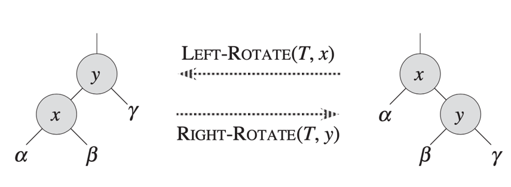
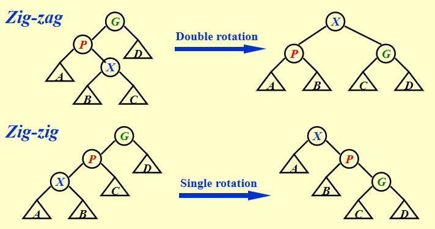
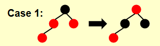
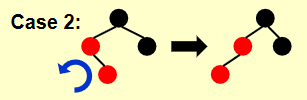
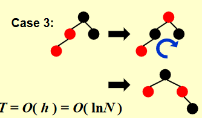
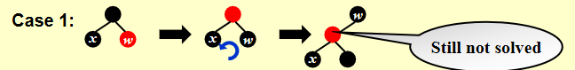
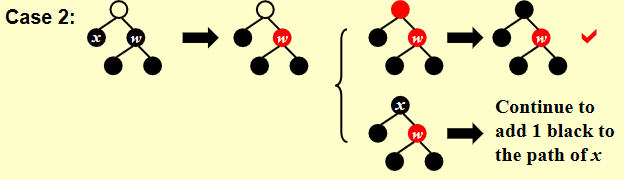
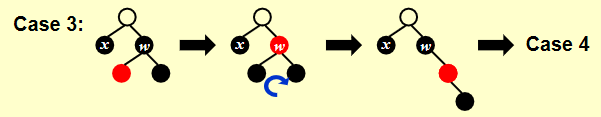
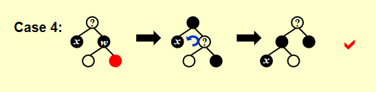

# AVL Tree:
每个操作**O(log n)**  
## Definition
An empty binary tree is height balanced.（定义深度为-1）  
If T is a nonempty binary tree with $T_L$ and $T_R$ as its left and right subtrees,  
T is balanced iff:  
(1) $T_L$ and $T_R$ are height balanced;  
(2) $|h_L - h_R| \le 1$  

The balance factor **BF(node)** = $h_L - h_R$. In an AVL tree, BF(node) $\in {-1, 0, 1}$

## Rotation 旋转
- Time Complexity O(1)  
- 从叶子往上找到第一个bug节点  
- 左高右旋右高左旋  
- LL，RR，LR，RL

- Left Rotate 左旋
- Right Rotate 右旋
  

## Insertion
Trouble Maker节点在：  
**左**子树的**左**子树：右旋 **LL rotation**  
**右**子树的**右**子树：左旋 **RR rotation**  
**左**子树的**右**子树：从下往上先左旋再右旋 **LR rotation**  
**右**子树的**左**子树：从下往上先右旋再左旋 **RL rotation**  

深度为h的树最少结点数$n_h = n_{h-1} + n_{h-2} + 1 = F(h+3) - 1 for h \ge -1$，F为斐波那契数。
$$F_i \approx \frac{1}{\sqrt{5}}(\frac{1+\sqrt{5}}{2})^i$$  
$$n_h = O(ln n)$$  

# Splay Tree
## Definition
连续M次操作总共不超过$O(Mlog n)$  
摊还成本 Amortized cost $\mathbf{O(log N)}!!!$  
IDEA: After a node is accessed, it is pushed to the ROOT by a series of AVL tree rotations.  
总是把最坏操作拎到根节点  
- zig-zag： 拎当前节点*2
- zig-zig： 先拎父节点再转这个节点  

  
**Splaying not only moves the accessed node to the root, but also roughly halves the depth of most nodes on the path.**  

## Deletion
Step 1: Find X (and then X becomes the root)  
Step 2: Remove X  
Step 3: FindMax($T_L$) (and the largest element becomes the rootof $T_L$)  
Step 4: Make $T_R$ the right child of the root of $T_L$
# Time Analysis
- worst-case bound
- amortized bound  
- average-case bound  

$$worst-case bound \ge amortized bound \ge average-case bound$$  

方法：  
- Aggregate analysis  
- Accounting method  
- Potential method  

# Amortized Analysis
Target: 连续M次操作为O(Mlog N)  

## Aggregate analysis
Idea :  Show that for all n, a sequence of n operations takes worst-case time T(n) in total.  In the worst case, the average cost, or amortized cost, per operation is therefore T(n)/n.  

## Accounting method  
amortized cost $\hat{c_i}$  
actual cost $c_i$  
$\hat{c_i} - c_i = credit (>=0)$  
We MUST have:  
$$ T_{amortized} = \frac{\sum_{i=1}^n \hat{c_i}}{n} \ge \frac{\sum_{i=1}^n c_i}{n}$$
- average case bound

## Potential method
(for amortized analysis)  
$$ \hat{c_i} - c_i = Credit = \Phi(D_i) - \Phi(D_{i-1})$$
$$ \sum_{i=1}^n \hat{c_i} = \sum_{i=1}^n (c_i + \Phi(D_i) - \Phi(D_{i-1})) \\ = (\sum_{i=1}^n c_i) + \Phi(D_n) - \Phi(D_0)$$

势能函数初始 **全局最小**，$\Phi(D_n) - \Phi(D_0) \ge 0$。  

## Splay Tree
$$\Phi(T) = \Sigma Rank(i) \\ 
Rank(i) = log S(i)$$  
S(i) is the number of decendants of i including itself  
- **Zig**  
 $$\hat{c_i}\\
  = 1 + R2(x) - R1(x) + R2(P) - R1(P) \\ 
  <= 1 + R2(x) - R1(x)\\$$
- **Zig-zag**  
$$\hat{c_i}  \\
= 2 + R2(x) - R1(X) + R2(P) - R1(P) + R2(G) - R1(G)  \\
= 2         - R1(X) + R2(P) - R1(P) + R2(G)\\  
= (2 + R2(P) + R2(G)) - R1(X) - R1(P)\\
<= 2(R2(x) - R1(x))$$
- theory: If a + b <= c, then log(a) + log(b) <= 2log(c) - 2.  
- **Zig-zig**  
$$\hat{c_i}\\
= 2 + R2(x) - R1(x) + R2(P) - R1(P) + R2(G) - R1(G)  \\
<= 3(R2(x) - R1(x))  \\
\mathbf{S1(x) + S2(G) = S2(x)}\\ 
=>  \hat{c_i} = 2 - R1(x) + R2(P) - R1(P) + R2(G)  \\
<= 2 - R1(x) + R2(P) - R1(P) + 2 * R2(x) - 2 - R1(x)  \\
= 2(R2(x) - R1(x)) + R2(P) - R1(P)  \\
<= 3(R2(X) - R1(X))  $$
## Therorem
The amortized time to splay a tree with root T at node X is at most 3(R(T) - R(x)) + 1 = O(log N)

# Red-Black Tree
## Definition
1. 非红即黑  
2. 根黑  
3. 叶子节点（外部）（哨兵节点）NIL为黑（所有“叶子”的子节点都是NIL）  
4. 红节点的儿子是黑色，黑节点的儿子可以是黑色  
5. 对每一个节点，到所有后代的路径中包含相同数量的黑色节点  
## black-height (bh)
从x到叶子节点的黑节点个数（不含x），bh(Tree) = bh(root)  
有N个内部节点的树最高 2ln(N+1)  
- 1. $sizeof(x) >= 2^{bh(x)} - 1$    (prove by induction)
- 2. $bh(Tree) \ge h(Tree)/2$

## Insertion
### 插入并染红  ->  破坏2，4
**case1:**   
将父节点染黑 -> 父节点的兄弟染黑 -> 将爷爷染红   锅甩给爷爷（只改色不旋转）  
    一路甩到根 -> 根染黑  
    甩到根的儿子 -> 那没事了  
O(log N)  
  

### “叔叔你怎么已经黑了？”
**case2:**  
我在右边 -> 绕父节点左旋变成case3 （加上case3一共旋转2次）  
O(1)  
   
**case3:**  
我在左边 -> 染完了，不平衡了，向右转 （转1次）  
O(1)  
   

***最多旋转2次！***

## Deletion
- 总之是删了个叶子
（直接删目标叶子or用后代叶子的值替代目标节点然后删叶子）
### 1. 红叶子，无事发生
### 2. 黑叶子 -> 身上叠两层黑（很黑）-> 破坏1
(1) **父节点红，兄弟黑**   

-> 父亲变黑兄弟变红 -> ok了，把叶子删掉

(2) **case1：兄弟红（父亲一定黑）**   

-> 父亲变红，兄弟变黑，兄弟转上去，黑侄子变兄弟 -> 同上一种情况
  

(3) **兄弟为黑：**  

- **case2：侄子均黑**  
    -> 兄弟变红，黑色传给父亲 -> 父亲红变黑 or 父亲已经是黑色，向上甩锅
      
- **case3：近侄子红，远侄子黑**  
    -> 近侄子染黑，转成兄弟 -> 变成case4  
      
- **case4：近侄子随便，远侄子红**  

    -> 父节点与兄弟节点交换颜色，远侄子染黑 -> 兄弟节点转上去 -> 删除

# B+ Tree
## Definition
A B+ Tree of order M:
- root is either a leaf or has 2~M children
- all nonleaf nodes have between $\lceil \frac{M}{2} \rceil$ and M children
- all leaves are at the same depth  
B+ Tree of order 4: "2-3-4 tree"  
真实数据在叶子里，父节点保存从第二个子树开始每个子树的最小元素  
M通常为3~4
## Find
和BST差不多
## Insertion
找位置 O(log N);  插入节点内 O(M); 总共O(log N)
- 节点内满了 -> 向上递归分裂
## Deletion
- 能删就直接删
- 节点键不够  ->  与兄弟合并
- 合并后向上递归

# Inverted File Index 倒排表
## Term-Document Incidence Matrix
稀疏矩阵表示文档及其包含的词  
-> 词典terms + 出现次数times + 出现文档documents  
查找时按照出现次数从小到大取交集
- 词干处理 Word Stemming （时态不管）
- 停用词 Stop Words （a an the等高频词）
- 定义偏序关系（如词典序），用树处理
## Distribute indexing
- Solution 1: Term-partitioned index
- Solution 2: Document-partitioned index  
第一种方案效率高，因为可以同时查询多个词  
第二种方案鲁棒性高，因为不容易完全崩掉啥也查不到（最多查不全）
## Dynamic indexing
维护两套索引 main index 和 auxiliary index  
向 auxiliary index 添加新内容，定期合并到 main index  
删除时打上“删除了！”的标签  
两套 index 都要查找
## Posting list
记录单词出现的位置  
->  数字太大  
->  保存相邻两个位置的差值
## Thresholding
重要性排序

# Leftist Heaps 左偏树/左偏堆
## Definition
Npl(NULL) = -1  
Npl(X) = min{Npl(X) + 1 for C in children of X}  
npl(null path legth) 左 >= 右 for all nodes  
左偏性（leftist heap property）：For every node X in the heap, the npl of the left child is at least as large as that of the right child.  
## Theorem 
A leftist tree with r nodes on the right path must have at least $2^r - 1$ nodes.  
## Merge
merge H1 & H2:  
H1 == NULL -> H2;  
H2 == NULL -> H1;  
取根节点键较小的作为H1,  
H1为单个节点 -> H1->left = H2  
else
- H1->right = Merge(H1->right, H2)
- swap H1->left H1->right if necessary
- H1->npl = H1->right->npl + 1  
  

$$T = (log N)$$  

## Delete
delete the root  
merge subtrees  
**T = O(log N)**

# Skew Heaps 斜堆
## Target
连续M次操作O(M * logN)  
$$T_{amortized} = O(log N)$$
## Merge
空 + ？ -> ？  
非空 + 非空 -> 取较小的根，新根的右儿子与另一树合并  
**ALWAYS** 交换左右儿子  
## Insertion
新节点与旧树merge  
## Deletion
删除根节点，左右子树合并  
## amortized analysis
- heavy：右子树节点数 > 左子树  
- light：左子树节点数 > 右子树  
- $D_i$ = root of the resulting tree
- 势能函数 $\Phi(D_i)$ = num of heavy nodes  
- 仅原树右支上的节点状态改变  
- l: light; h: heavy  
  在右支上：  
  合并前 $\Phi_0 = h1 + h2 + h$  
  合并后 $\Phi_N \le l1 + l2 + h$  
- $T_{worst} = l1 + h1 + l2 + h2$  
  $T_{amortized} = T_{worst} + \Phi_N - \Phi_0  \le 2(l1 + l2) = O(log N)$

# Binomial Queues
## Structure
- a **collection** of heap-ordered trees, known as a **forest**  
- each heap-ordered tree is a binomial tree  
- a binomial tree of height 0 is a one-node tree  
- a binomial tree $B_k$ of height k is formed by attaching a $B_{k-1}$ to the root of another $B_{k-1}$  
- $B_k$ consists a root with k children $B_1~B_k$, has $2^k$ nodes, and has $C_k^d$(or $(_d^k)$) nodes at depth d  
## Find Min
choose from $\lceil log N \rceil$ roots, $$T_p = O(log N)$$
## Merge
树的高度不重复 -> 保留  
两森林中有相同高度（k）的二项堆 -> 合并为高度k+1的树  
类似二进制加法，第i位代表高度为i的树，1 + 1 -> 进位  
使用左儿子右兄弟存储每棵树。为了方便合并两棵树，兄弟应当从高到矮  
## Delete Min
找到最小的根节点  
把它删掉，它的儿子加入队列等待合并  
原队列与新队列合并
## Time Analysis
Claim: A binomial queue of N elements can be built by N successive insertions in O(N) time  
- 势能分析  
    高开销 -> 降低树的数量；低开销 -> 树变多  
    以树的数量作为势能  
    $C_i$::= cost of $\bold{i}$th insertion  
    $\Phi_i$::= num of trees after $\bold{i}$th insertion  
    $C_i + (\Phi_i - \Phi_{i-1}) = 2$  
    $\sum_{i=1}^N (C_i + \Phi_i - \Phi_{i-1}) = 2N$  
    $\sum_{i=1}^N C_i = 2N - \Phi_N \le 2N = O(N)$  

$$T_{worst} = O(log N), T_{amortized} = 2$$

# Backtracking 回溯算法
Usually using depth first search.  
**UNDO** if fail !!!  
## Eight queens
## Turnpike Reconstruction Problem
Given N(N-1)/2 distances, reconstruct a point set of N from the distances.  
## Stick Problem
Cut a number of small sticks of the same length into sections at random and put back together. Find the minimum possible length of th original sticks.  
Suppose i th section is put into the X[i]th stick.  
The i th layer in the game tree is the place of the i th section.  
Candidates are the divisors of the total length.  

剪枝办法：
- 长度比最长木棍还短

## 三子棋
MiniMax Strategy (probably with alpha-beta pruning that linits the searching to only $O(\sqrt{N})$, N is the size of the full game tree)
## Eight digits
A digit board with eight digits and an empty space, aiming to put them into the right order. Find the minimum number of moves.  
剪枝办法：
- 忽略空格交换的约束条件，最少情况仍大于已有情况则剪掉

# Devide and Conquer 分治
## Definition
Recursively:
- Devide the problem into a number of sub-problems
- Conquer the sub-problems by solving them recursively
- Combine the solutions to the sub-problems into the solution for the original problem
## Time Analysis
$T(N) = a*T(N/b) + f(N)$  
- $f(N) = cN: T(N) = O(N logN)$
- $f(N) = cN^2: T(N) = O(N^2)$

**Wrong guess:**  
  $T(N) = 2\lfloor \frac{N}{2} \rfloor + N = O(N)$  
  Suppose T(m) <= cm for all m <= N/2,  
  then T(N) <= cN + N = O(N) **(FALSE!)**

### Master Method 主方法
$$
T(N) = \begin{cases}
\Theta(N^{log_ba}) & f(N) = O(N^{log_ba-\xi})\\
\Theta(N^{log_ba}logN) & f(N) = \Theta(N^{log_ba})\\
\Theta(f(N)) & f(N) = \Omega(N^{log_ba+\xi})\\
\end{cases}
$$
Another form:  
$$
T(N) = aT(N/b) + \Theta(N^klog^pN) \\
T(N) = \begin{cases}
O(N^{log_ba}) & a > b^k \\
O(N^klog^{p+1}N) & a = b^k \\
O(N^klog^pN) & a < b^k
\end{cases}
$$

# Dynamic Programming 动态规划
状态：**唯一**表达一个子问题的解；  
状态+状态转移方程确定一个算法  
要按照规模递减~（比较好写代码）  
- 定义状态  
- 以第一步或最后一步为例思考如何切割，写出状态转移方程  
- 检查最优子结构是否成立（原问题最优解是否建立在子问题最优解之上）  
## 斐波那契数
## 矩阵乘法排序
$M_{a*b} \cdot M_{b*c}$的时间复杂度为$O(abc)$  
对于$M_{10*20}*M_{20*50}*M_{50*1}*M_{1*100}$，不同乘法顺序的时间复杂度度不同  
计算$M_1*M_2*M_3*...*M_n$：  
- 暴力枚举的方案数$b_n$：  
对最外面两个括号$(M_1*...*M_k)*(M_{k+1}*...M_n)$，两侧括号位置已定，枚举中间" )( "的位置。  
然后分成两个子问题 $M_1*...*M_k$ 和 $M_{k+1}*...M_n$  
$$
b_n = \sum_{i=1}^{n-1}b_ib_{n-i} = O(\frac{4^n}{n\sqrt{n}})
$$

- 动态规划：  
$F[N] = \sum F[i]*F[N-i]$（不能唯一确定）  
=> 用$F[N][i]$表示从i开始长度为N的序列的最小代价（唯一确定）  
考虑$(M_1M_2)(M_3M_4)$：总代价为$F[2][1] + F[2][3] + R_1*C_2*C_4$  
则
$$
F[N][i] = min_{1 \le k < N}\{F[k][i] + F[N-k][i+k] + R_i*C_{i+k-1}*C_{i+N-1}\}
$$
## Optional Binary Search Tree
Given N words $w_1 < w_2 < ... < w_N$, and the probability of searching for each w_i is p_i. Arrange these words in a BST that minimize the expected total access time.    
$F[N][i]$表示规模为N，从$w_i$开始的子问题  
$$
F[N][i] = min_{0 \le k \le N}\{\sum_{j=i}^{i+N-1}p_j + F[k][i] + F[N-k-1][i+k+1]\}
$$

## All-Pairs Shortest Path
## Product Assembly
$F[N][i]$表示装前N个零部件后在第i条生产线（$i \in \{0, 1\}$)
$$
F[N][i] = min\{F[N-1][0]+t_{0->i, i}, F[N-1][1]+t_{1->i, i}\}
$$